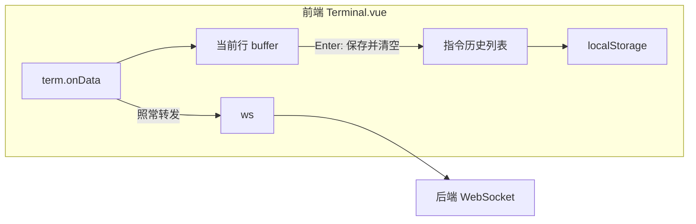

# 终端指令历史库：需求与设计（Plan）

本文档整理自 Cursor Plan「终端指令历史库」，并按 `design/_template-plan.md` 统一格式沉淀在 `docs/design`，用于扩展现有终端页能力：在 SSH 终端右侧提供可点击的指令历史列表。

---

## 1. 目标与范围

| 项目 | 说明 |
|------|------|
| 目标 | 在现有 `Terminal.vue` + xterm.js 终端基础上，新增「指令历史」侧栏：记录用户在终端中实际发送过的命令，并支持点击历史条目快速回填（可选直接执行），提升操作效率。 |
| 本阶段范围 | **包含**：前端在用户按 Enter 时从输入缓冲中截取当前行，记录为历史；指令历史本地持久化；右侧布局与点击交互；**不包含**：后端存储、预置命令模板、AI 助手等高级能力。 |
| 依赖/前置 | 已有终端实现（`frontend/src/views/dashboard/Terminal.vue` + xterm.js + WebSocket）、终端连接保持与主题联动方案（见相关 design 文档）。 |

---

## 2. 功能需求

| 项目 | 说明 |
|------|------|
| 必须 | 1）自动记录用户在终端中发送的命令行文本（基于 Enter 结束）；2）在终端页右侧显示最近指令历史列表，可滚动查看；3）点击某条历史可将命令写入当前终端输入行（默认仅填入，不自动执行）；4）历史在刷新后仍可看到（本地持久化）。 |
| 可选/后续 | 1）点击历史项时提供「填入」与「填入并执行」两种模式；2）在同一侧栏增加「常用指令库」「AI 助手」Tab，与 `feature-roadmap.md` 中终端增强规划衔接；3）按命令分类、搜索、标星。 |

交互与体验：与现有终端页风格一致，右侧列表支持 hover 高亮与 title 展示完整命令；危险命令仍由用户自行确认，默认行为仅回填不直接执行。

---

## 3. 接口约定

本功能**不新增后端接口**，全部逻辑在前端完成：

| 方法 | 路径 | 说明 |
|------|------|------|
| — | — | 指令历史使用 `localStorage` 本地存储，不通过 HTTP/WS 单独传输。 |

终端与服务器的命令传输仍使用原有 WebSocket 协议（`/ws/terminal`），本功能仅在前端 `term.onData` 层增加一层“观察与记录”逻辑，不改变实际发送内容。

---

## 4. 数据与存储

- **历史记录结构**：简单字符串数组，如 `["df -h", "docker ps", ...]`，可视为发送过的原始命令行文本。
- **持久化方式**：`localStorage`，key 建议为 `panel_terminal_command_history`，值为 JSON 数组。
- **容量控制**：建议上限 300～500 条，超出时丢弃最旧记录；单条命令可按 512 字符左右截断。
- **去重策略**：当新命令与已有历史重复时，将该条移动到列表前端（最近优先），避免相同命令重复堆积；空命令或全空白行不入库。

---

## 5. 后端实现要点

无。后端 WebSocket 终端实现保持不变：仍然按数据流将用户输入透传到 SSH channel，本功能仅在前端侧增加历史记录与展示。

---

## 6. 前端实现要点

- **改动文件**：优先在 `frontend/src/views/dashboard/Terminal.vue` 内完成；若后续需要在其它页面复用，可将「历史列表」抽成子组件。
- **状态管理**：
  - 使用 `ref<string[]>` 存储指令历史数组；
  - 使用一个局部 `buffer` 字符串维护「当前行」。
- **数据流改造**：
  - 在 `term.onData(data)` 回调内，先根据 `data` 更新 `buffer`：普通可见字符追加，`\x7f` 退格删除末字符，`\r`/`\n` 标记一条命令结束。
  - 当检测到行结束且 `buffer` 非空时，将其写入历史数组（应用去重与上限策略），同时更新 `localStorage`，然后清空 `buffer`。
  - 最后保持原有逻辑：在连接状态下将 `data` 原样通过 WebSocket 发送给后端。
- **多行与粘贴**：若一次 `data` 内含多个 `\r`/`\n`，按行拆分逐条处理，避免整段粘贴只当一条记录。
- **侧栏布局**：
  - 在终端区域下方改为左右布局：左侧为 `.terminal-container`（`flex: 1; min-width: 0`），右侧为固定宽度（例如 `280px`）的「指令历史」侧栏，`overflow-y: auto`。
  - 终端区域依赖现有 ResizeObserver + FitAddon 自动适应缩窄后的宽度，无需额外逻辑。
- **点击行为**：
  - 默认行为：点击列表项时调用 `term.write(cmd)`，把命令文本写入当前终端输入行，由用户再按 Enter 决定是否执行；
  - 若未来需要「一键执行」，可在 UI 上增加单独按钮或选项，调用 `term.write(cmd + '\r')`。
- **清空历史**：在侧栏顶部提供「清空」按钮，删除 `localStorage` 对应 key 并清空历史数组。

---

## 7. 与后续阶段衔接

- 与 `docs/project/feature-roadmap.md` 中「终端：常用指令库 + 简易 AI 对话」保持一致：本功能先实现**用户历史**部分，将来可以在同一侧栏中增加「常用指令库」「AI 助手」分区。
- 与终端后台保持连接/一户多机等能力兼容：指令历史仅基于前端输入，不依赖具体连接目标，未来可在记录结构中扩展诸如 `server_id`、时间戳等附加信息。

---

## 8. 本阶段完成清单

- [ ] 需求与设计评审（本 Plan）
- [ ] `Terminal.vue` 中 `term.onData` 数据流改造（行缓冲 + 历史写入，不影响原有行为）
- [ ] 本地历史加载与写入逻辑（含容量与去重）
- [ ] 右侧「指令历史」侧栏布局与列表 UI
- [ ] 点击历史项回填终端输入（默认仅填入）
- [ ] 清空历史按钮与功能
- [ ] 基本测试（包含多行粘贴、退格、未连接时行为等）

---

## 9. 文档更新记录

| 日期 | 变更说明 |
|------|----------|
| 2026-03-10 | 根据 Cursor Plan「终端指令历史库」整理为统一 Plan 格式并迁移至 `docs/design`。 |

---

## 附录：原始 Cursor Plan 内容

> 以下为原 `C:\Users\Meilingluo\.cursor\plans\终端指令历史库_bbff2910.plan.md` 的正文内容，便于查阅最初的详细思考过程。

# 终端指令历史库 — 设计与实现计划

## 1. 可行性结论

**可以实现。** 当前终端基于 [frontend/src/views/dashboard/Terminal.vue](frontend/src/views/dashboard/Terminal.vue) + xterm.js，用户按键通过 `term.onData(data)` 经 WebSocket 发往后端。在前端对 `onData` 做一层拦截即可在「按 Enter」时得到当前行内容并写入历史；布局上用 flex 让终端区域左缩进、右侧固定宽度做可滚动列表即可，无需改后端。

---

## 2. 数据流与“指令”的界定

- **现有流**：`term.onData(data)` → 若已连接则 `ws.send(data)`，后端原样写入 SSH channel。
- **需要新增**：在 `onData` 中维护**当前行缓冲**（buffer），根据按键更新 buffer；当 `data` 为 `\r` 或 `\n` 时，将 buffer 视为一条「已发送指令」，去重/追加到历史并持久化，再清空 buffer，然后**照常**把 `data` 发给后端（不影响原有连接行为）。

- **退格**：收到 `\x7f`（DEL）时从 buffer 末尾删一字符，不发给后端前可照常转发（后端/shell 会处理）。
- **多行粘贴**：若一次 `data` 内包含多个 `\r`/`\n`，可按行切分，逐条非空行写入历史。

---

## 3. 布局与交互

- **布局**：在 `.terminal-section` 内，将当前单一的「工具栏 + 下方整块 terminal 容器」改为：
  - 工具栏仍占一整行（标题 + 连接/断开）。
  - 下方为一行 flex：**左侧**为现有 `.terminal-container`（`flex: 1; min-width: 0`），仅包裹 xterm 的 `terminalRef`；**右侧**为新增「指令历史」侧栏（固定宽度，如 `280px`），内部可上下滚动（`overflow-y: auto`），列表展示历史指令。
- **终端宽度**：右侧缩进后，`.terminal-container` 宽度由 flex 收缩，已有 ResizeObserver + FitAddon 会重新 `fit()`，无需额外逻辑。
- **点击历史项**：将该项文本写入终端。两种可选行为（可做成设置或默认一种）：
  - **仅填入**：`term.write(cmd)`，用户可编辑后再按 Enter。
  - **填入并执行**：`term.write(cmd + '\r')`，直接发送到 shell。
- 建议默认**仅填入**，避免误点危险命令；若需要「执行」可再加小按钮或右键菜单。

---

## 4. 存储与去重策略

- **存储**：`localStorage`，key 如 `panel_terminal_command_history`，值为 JSON 数组，如 `["cmd1", "cmd2", ...]`。
- **容量**：建议上限 300～500 条，超出时删最旧；单条过长可截断（如 512 字符）再存。
- **去重**：新命令若与已有项相同，可将该项移到列表前端（“最近使用”在前），避免重复条目不无限增长；空字符串或纯空白不写入。

---

## 5. 实现要点（仅前端）

| 项目            | 说明                                                                                                                                                   |
| ------------- | ---------------------------------------------------------------------------------------------------------------------------------------------------- |
| **文件**        | 仅改 [frontend/src/views/dashboard/Terminal.vue](frontend/src/views/dashboard/Terminal.vue)（若希望复用，可把「历史列表」抽成子组件，非必须）。                                  |
| **状态**        | `ref`：历史列表数组、当前行 buffer（仅逻辑用，可不展示）。                                                                                                                  |
| **onData 改造** | 在现有 `term.onData` 回调中：先根据 `data` 更新 buffer（可打印字符追加、`\x7f` 退格、`\r`/`\n` 视为行结束并提交 buffer 到历史）；再保持原有 `if (ws && status === 'connected') ws.send(data)`。 |
| **历史持久化**     | 读取：`onMounted` 时从 localStorage 解析并赋给历史 ref；写入：每次新命令入列后，将数组序列化写回 localStorage（并做上限与截断）。                                                               |
| **侧栏 UI**     | 列表按「最近在前」渲染；每项可显示命令摘要（长命令可 CSS 截断 + title）；点击时调用 `term.write(该项 + '\r')` 或 `term.write(该项)`。                                                         |
| **无障碍**       | 侧栏加标题（如「指令历史」），列表项用 `button` 或可聚焦元素，便于键盘与读屏。                                                                                                         |

---

## 6. 与现有路线图的关系

[feature-roadmap.md](docs/project/feature-roadmap.md) 中「终端：常用指令库 + 简易 AI 对话」包含两类能力：

- **常用指令库**：预置/用户可维护的模板（如分类：系统、网络、Docker）。
- **用户发送过的指令**：即本次要做的「记录并展示历史」。

本次实现仅做**用户历史**；预置模板、分类、AI 助手等可在本方案上线后，在同一侧栏中增加 Tab 或分区（如「历史」/「常用」）再扩展。

---

## 7. 测试与边界

- 未连接时：仍可记录历史（若希望仅“连接状态下发送的指令”才记录，可在提交历史时判断 `status.value === 'connected'`）。
- 快速连续输入与粘贴：buffer 按行切分后逐条写入，避免整段粘贴被当成一条。
- 清空历史：可在侧栏顶部提供「清空」按钮，删除 localStorage 对应 key 并清空 ref。

---

## 8. 小结

- **实现范围**：仅前端 [Terminal.vue](frontend/src/views/dashboard/Terminal.vue)；后端与 WebSocket 协议不改。
- **核心逻辑**：在 `onData` 中维护行缓冲，Enter 时写入历史并持久化；布局右侧固定宽度侧栏，点击历史项写入终端（默认仅填入，可选执行）。
- **存储**：localStorage，带容量上限与简单去重。  
按上述方案即可实现「记录用户曾经发送过的所有指令 + 右侧可滑动指令库 + 点击发送到终端」的需求。

