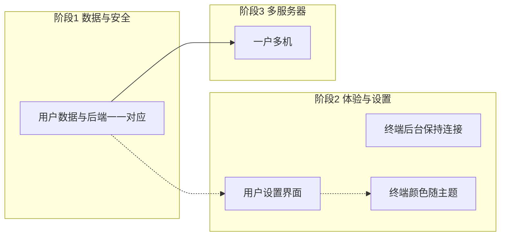

# PanelLab 功能完善计划（用户数据、终端、设置、多服务器）

本文档针对五项功能完善需求做现状梳理、目标定义与技术方案讨论，便于后续拆分为具体设计与开发任务。

---

## 1. 用户数据与后端数据一一对应

### 1.1 现状

- **认证**：JWT + `User` 表（`backend/models/user.py`），登录态有效。
- **业务数据**：站点配置（`SiteConfig`）、远程监控/终端用到的 SSH 配置（`MonitorRemoteConfig`）均**无 `user_id`**，所有已登录用户看到并操作同一份数据。
- **接口**：`backend/routers/sites.py`、`backend/routers/terminal.py`、Monitor/DB 相关路由均只做 `get_current_user`，不做按用户过滤。

### 1.2 目标

- 用户与后端保存的服务器/站点等数据**一一对应**，且**权限与安全**可管控（避免越权访问、误删他人数据）。
- 可选项：仅“数据归属”隔离，或在此基础上做简单角色（如管理员可看全部、普通用户仅自己的）。

### 1.3 方案要点（已实施）

- **数据模型**：
  - `SiteConfig` 已增加 `user_id`（FK `users.id`），唯一约束改为按用户：`(user_id, name)`、`(user_id, domain)`。
  - `MonitorRemoteConfig` 已增加 `user_id`，每用户一条远程监控/终端配置。
  - 新增表 `servers`（模型 `Server`）：`id`, `user_id`, `name`, `host`, `port`, `username`, `password_encrypted`，为后续一户多机预留。
- **API**：站点、远程配置、终端均已按 `current_user.id` 过滤；创建站点/保存远程配置时写入 `user_id`。
- **已有库升级**：在 `backend` 目录执行 `python migrate_phase1_user_data.py` 一次，将现有数据关联到首个用户并创建 `servers` 表；新环境直接运行 `python -m init_db` 即可。

---

## 2. 终端连接切换页面后保持（后台运行）

### 2.1 现状

- 连接与 xterm 实例均只在 `frontend/src/views/dashboard/Terminal.vue` 内维护，无全局 store 或 service。
- 在 `onBeforeUnmount` 中执行：ResizeObserver 断开、`ws.close()`、`term.dispose()`，故**切换路由离开终端页即断开连接**。

### 2.2 目标

- 终端连接在用户切换到其他界面时**保持后台运行**，再次进入终端页可**恢复显示**，使用体验连贯。

### 2.3 技术方案选项（可讨论）

| 方案 | 思路 | 优点 | 缺点/注意点 |
|------|------|------|-------------|
| **A. 终端状态提升到 Pinia + 连接常驻** | 将 WebSocket 连接、连接状态放到 Pinia store（或独立 service）；Terminal.vue 只负责挂载时从 store 取连接并挂上 xterm 显示，卸载时只 detach 不关连接。 | 切换页面不关 ws，回来时重新 attach 即可。 | 需统一管理连接生命周期（如刷新页、登出时关闭）；需处理 xterm 与 DOM 的 attach/detach 与 resize。 |
| **B. 终端页不随路由销毁** | 用 `<KeepAlive>` 包裹终端路由组件，或把终端作为 Layout 下的固定区域（如抽屉/底栏），仅隐藏不 unmount。 | 实现简单，无需改后端。 | 占用常驻 DOM 与内存；与当前“终端是一级页面”的路由结构需调整。 |
| **C. 后台 Worker/SharedWorker + 重连** | 连接放在 Worker 或 SharedWorker，页面通过 postMessage 与 worker 通信；多 tab 可共享同一连接。 | 多 tab 可共享。 | 复杂度高，且后端 WebSocket 通常按连接数计费/限流，多 tab 共享未必必要。 |

**推荐方向**：优先 **方案 A**（Pinia/store 持有一个“当前终端连接”单例，Terminal.vue 挂载时绑定、卸载时只解除 xterm 绑定），在讨论中可再定是否接受方案 B 作为简化替代。

---

## 3. 终端颜色随系统/主题变化

### 3.1 现状

- 应用主题： `frontend/src/theme.js` 通过 `data-theme` 写入 `<html>`，`frontend/src/style.css` 中 `[data-theme="light"]` / `[data-theme="dark"]` 定义 CSS 变量（如 `--bg-primary`, `--text-primary` 等）。
- 终端： `frontend/src/views/dashboard/Terminal.vue` 内 xterm 的 `theme` 与容器样式均为**写死的 hex 色值**（如 `#f8f9fa`），不随主题切换。

### 3.2 目标

- 终端背景、前景、光标等颜色**随系统/应用主题变化**，与整站外观一致。

### 3.3 实现要点

- **xterm.js**：在创建 `Terminal` 时，不写死 `theme`，改为根据当前 `data-theme`（或从 `getTheme()`）读取对应的一组颜色；若 xterm 支持动态 `setOption('theme', ...)`，可在主题切换时调用更新。
- **颜色来源**：从 CSS 变量读取（在挂载或 theme 变化时用 `getComputedStyle(document.documentElement).getPropertyValue('--bg-primary')` 等），或在前端维护两套 theme 对象（light/dark）与 `style.css` 中的变量对齐。
- **容器与 viewport**：`.terminal-container`、`:deep(.xterm-viewport)`、`:deep(.xterm-screen)` 等背景色改为 `var(--bg-secondary)` 或与 `--bg-primary` 一致，避免继续使用 `#f8f9fa` 等硬编码。

---

## 4. 用户个性化设置功能界面

### 4.1 现状

- 无独立“设置”或“个人资料”页；仅在 `frontend/src/views/DashboardLayout.vue` 中有用户名校显、主题切换、修改密码弹窗、登出。
- 路由中无 `/settings` 或 `/profile`。

### 4.2 目标

- 提供**用户个性化设置界面**：集中管理主题、密码、可选的语言/时区等，便于扩展更多个人偏好。

### 4.3 实现要点

- **路由与页面**：在 dashboard 下新增路由（如 `path: 'settings'`），对应新页面 `frontend/src/views/dashboard/Settings.vue`（或 Profile.vue）；侧栏增加“设置”入口。
- **设置项**：
  - **已有能力迁移**：主题切换（可继续用 `theme.js` + localStorage）、修改密码（沿用现有 ChangePasswordModal 或内嵌表单，调用 `POST /api/auth/change-password`）。
  - **可选扩展**：显示名称/头像、语言、时区、通知偏好等；若后端需要持久化，可增加 `user_profile` 表或扩展 `users` 表，并增加 `GET/PUT /api/auth/me` 或 `GET/PUT /api/settings/profile`。
- **风格**：与现有仪表盘、表单风格一致，错误与成功提示方式统一。

---

## 5. 一户多机（一个账户管理多个服务器）

### 5.1 现状

- 仅有一个“远程主机”概念： `backend/models/monitor_remote.py` 的 `MonitorRemoteConfig` 单行配置，被监控与 `backend/routers/terminal.py` 终端共用。
- 站点（`SiteConfig`）是当前面板所在机的 Nginx 配置，与“多台服务器”无直接对应关系。

### 5.2 目标

- **一个账户可管理多台服务器**：每台服务器有独立 SSH（或未来其它）连接配置，用户可在终端、监控等模块中选择要操作的目标机。

### 5.3 方案要点（待定）

- **数据模型**：
  - 新增“服务器/主机”表（如 `servers` 或 `remote_hosts`），字段至少包含：`id`, `user_id`, `name`, `host`, `port`, `username`, `password_encrypted`（或 key 路径），`created_at`/`updated_at`。
  - 与第 1 节一致：`user_id` 保证数据归属与接口过滤。
- **接口**：`GET/POST/PUT/DELETE /api/servers`（或 `/api/hosts`），列表仅返回当前用户的服务器；终端与监控的 WebSocket/HTTP 接口增加 `server_id`（或 `host_id`）参数，连接时使用对应用户自己的那条配置。
- **前端**：
  - 设置或独立“服务器管理”页：CRUD 服务器列表。
  - 终端页、监控页：下拉或列表选择“当前服务器”，再执行连接或拉取监控数据。
- **与站点/数据库的关系**：当前站点、数据库管理仍绑定在“当前面板所在机”；若未来要支持“每台远程机上的站点/DB”，需再扩展为“按 server 维度”的配置与接口，可放在本阶段之后迭代。

---

## 6. 实施顺序建议与依赖关系

- **阶段 1**：先做用户数据与后端一一对应（第 1 节），为“按用户过滤”和“多服务器归属”打基础。
- **阶段 2**：终端后台保持（第 2 节）、终端主题同步（第 3 节）、用户设置页（第 4 节）可并行或按优先级排期，彼此依赖较小。
- **阶段 3**：一户多机（第 5 节）依赖“用户数据隔离”和“服务器”模型，建议在阶段 1 之后或与阶段 2 部分重叠。
